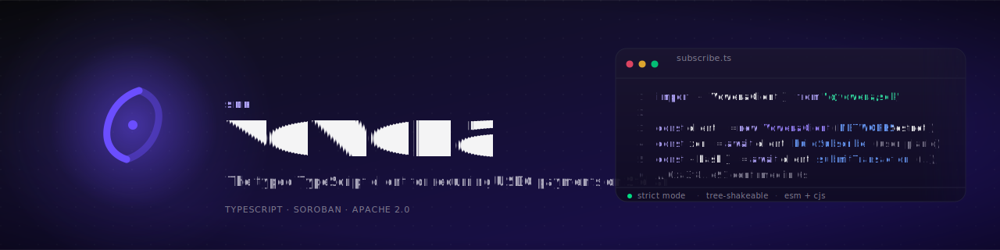

<div align="center">
  <a href="https://docs.vowena.xyz">
    
  </a>

  <p>
    <strong>The typed TypeScript client for recurring USDC payments on Stellar.</strong><br/>
    A small, strict wrapper around the Vowena Soroban contract. Built for production.
  </p>

  <p>
    <a href="https://www.npmjs.com/package/@vowena/sdk"></a>
    <a href="./LICENSE"></a>
    <a href="https://www.typescriptlang.org/"></a>
    <a href="https://github.com/vowena/sdk/actions/workflows/ci.yml"></a>
    <a href="https://bundlephobia.com/package/@vowena/sdk"></a>
  </p>

  <p>
    <a href="https://docs.vowena.xyz">Documentation</a>
    &nbsp;·&nbsp;
    <a href="https://github.com/vowena/protocol">Protocol</a>
    &nbsp;·&nbsp;
    <a href="https://github.com/vowena/dashboard">Dashboard</a>
    &nbsp;·&nbsp;
    <a href="https://vowena.xyz">vowena.xyz</a>
  </p>
</div>

<br/>

## What is this?

`@vowena/sdk` is the official TypeScript client for the [Vowena recurring payment protocol](https://github.com/vowena/protocol), the first subscription primitive on Stellar. It wraps the Soroban contract behind two narrow surfaces:

- **`build*` methods** assemble, simulate, and return base64 XDR ready for wallet signing. They never touch a key.
- **`get*` methods** simulate read-only calls and return parsed, typed values.

Everything is fully typed, side-effect free at construction, and runs in Node, Bun, Deno, edge runtimes, and the browser. The same client powers the [Vowena dashboard](https://github.com/vowena/dashboard) and the keeper bot that drives on-chain billing.

<br/>

## Install

```bash
npm install @vowena/sdk
```

<details>
<summary>pnpm / yarn / bun</summary>

```bash
pnpm add @vowena/sdk
yarn add @vowena/sdk
bun add @vowena/sdk
```

</details>

`@stellar/stellar-sdk` ships as a direct dependency. No additional setup is required.

<br/>

## Quick example

```ts
import {
  VowenaClient,
  NETWORKS,
  toStroops,
  SECONDS_PER_MONTH,
} from "@vowena/sdk";

const client = new VowenaClient({
  contractId: NETWORKS.testnet.contractId,
  rpcUrl: NETWORKS.testnet.rpcUrl,
  networkPassphrase: NETWORKS.testnet.networkPassphrase,
});

// 1. Build a transaction. Returns base64 XDR. Never touches a key.
const xdr = await client.buildCreatePlan({
  merchant: merchantAddress,
  token: NETWORKS.testnet.usdcAddress,
  amount: toStroops("9.99"),
  period: SECONDS_PER_MONTH,
  priceCeiling: toStroops("19.99"),
  name: "Pro monthly",
  projectId: 1,
});

// 2. Sign with the user's wallet (Freighter, Albedo, Lobstr, hardware, etc.)
const signed = await wallet.signTransaction(xdr, { network: "TESTNET" });

// 3. Submit and wait for ledger confirmation.
const result = await client.submitTransaction(signed);
console.log(result.hash, result.success);
```

<br/>

## API

The client exposes write builders (`build*`) and reads (`get*`). Every builder returns assembled, simulation-validated base64 XDR. Reads return parsed, typed values.

### Projects

A project groups one merchant's plans under a named, on-chain bucket.

| Method | Returns | Description |
| --- | --- | --- |
| `buildCreateProject(params)` | `Promise<string>` | Create a new on-chain project. The contract assigns the `project_id`. |
| `getProject(projectId, caller)` | `Promise<Project>` | Fetch a project by ID. |
| `getMerchantProjects(merchant, caller)` | `Promise<number[]>` | List project IDs owned by a merchant. |

### Plans

| Method | Returns | Description |
| --- | --- | --- |
| `buildCreatePlan(params)` | `Promise<string>` | Create a recurring plan (token, amount, period, ceiling, optional trial). |
| `buildUpdatePlanAmount(merchant, planId, newAmount)` | `Promise<string>` | Update a plan's recurring amount. Subscribers governed by `priceCeiling`. |
| `getPlan(planId, caller)` | `Promise<Plan>` | Fetch a plan by ID. |
| `getMerchantPlans(merchant, caller)` | `Promise<number[]>` | List plan IDs for a merchant. |
| `getPlanSubscribers(planId, caller)` | `Promise<number[]>` | List subscription IDs subscribed to a plan. |

### Subscriptions

| Method | Returns | Description |
| --- | --- | --- |
| `buildSubscribe(subscriber, planId, opts?)` | `Promise<string>` | Subscribe to a plan. SDK picks safe defaults for `expirationLedger` and `allowancePeriods`. |
| `buildCharge(caller, subId)` | `Promise<string>` | Charge a subscription for the current period. Permissionless. |
| `buildCancel(caller, subId)` | `Promise<string>` | Cancel a subscription. Either party may call. |
| `buildRefund(merchant, subId, amount)` | `Promise<string>` | Refund a subscriber. Merchant only. |
| `buildReactivate(subscriber, subId, opts?)` | `Promise<string>` | Reactivate a cancelled subscription. |
| `buildExtendTtl(caller, planId, subId)` | `Promise<string>` | Bump TTL of plan and subscription entries. Permissionless. |
| `getSubscription(subId, caller)` | `Promise<Subscription>` | Fetch a subscription by ID. |
| `getSubscriberSubscriptions(subscriber, caller)` | `Promise<number[]>` | List subscription IDs owned by a subscriber. |

### Migrations

Plan migrations are a two-step handshake: the merchant proposes, the subscriber consents.

| Method | Returns | Description |
| --- | --- | --- |
| `buildRequestMigration(merchant, oldPlanId, newPlanId)` | `Promise<string>` | Propose moving subscribers from one plan to another. |
| `buildAcceptMigration(subscriber, subId, opts?)` | `Promise<string>` | Accept a pending migration. Re-authorizes the SAC allowance. |
| `buildRejectMigration(subscriber, subId)` | `Promise<string>` | Reject a pending migration. The original plan continues. |

### Read

Read methods simulate against the RPC and return decoded values. They cost nothing on chain.

| Method | Returns | Description |
| --- | --- | --- |
| `getProject(projectId, caller)` | `Promise<Project>` | Single project by ID. |
| `getMerchantProjects(merchant, caller)` | `Promise<number[]>` | All project IDs for a merchant. |
| `getPlan(planId, caller)` | `Promise<Plan>` | Single plan by ID. |
| `getMerchantPlans(merchant, caller)` | `Promise<number[]>` | All plan IDs for a merchant. |
| `getPlanSubscribers(planId, caller)` | `Promise<number[]>` | All subscription IDs on a plan. |
| `getSubscription(subId, caller)` | `Promise<Subscription>` | Single subscription by ID. |
| `getSubscriberSubscriptions(subscriber, caller)` | `Promise<number[]>` | All subscription IDs for a subscriber. |

### Utilities

| Export | Type | Description |
| --- | --- | --- |
| `submitTransaction(signedXdr)` | `Promise<TransactionResult>` | Submit signed XDR and wait for confirmation. |
| `toStroops(amount)` | `(string \| number) => bigint` | Convert a human amount to 7-decimal stroops. |
| `fromStroops(stroops)` | `bigint => string` | Convert stroops back to a string with no float loss. |
| `getEvents(rpcUrl, contractId, fromLedger)` | `Promise<{ events; latestLedger }>` | One-shot fetch of contract events. |
| `VowenaEventPoller` | `class` | Continuous event polling with backoff. |
| `NETWORKS` | `const` | Pre-configured testnet and mainnet endpoints. |
| `USDC_DECIMALS` | `7` | Decimal places for USDC on Stellar. |
| `SECONDS_PER_DAY` | `86_400` | Time constant. |
| `SECONDS_PER_MONTH` | `2_592_000` | Time constant (30 days). |
| `SECONDS_PER_YEAR` | `31_536_000` | Time constant (365 days). |

### Types

```ts
import type {
  Project,
  Plan,
  Subscription,
  SubscriptionStatus,
  CreateProjectParams,
  CreatePlanParams,
  VowenaClientOptions,
  TransactionResult,
  VowenaEvent,
  EventPollerOptions,
} from "@vowena/sdk";
```

<br/>

## Networks

Pre-configured network settings ship as a typed constant. Use them directly to avoid hardcoding endpoints.

```ts
import { NETWORKS } from "@vowena/sdk";

NETWORKS.testnet;
// {
//   rpcUrl: "https://soroban-testnet.stellar.org",
//   networkPassphrase: "Test SDF Network ; September 2015",
//   contractId: "CCNDNEGYFYKTVBM7T2BEF5YVSKKICE44JOVHT7SAN5YTKHHBFIIEL72T",
//   usdcAddress: "CARX6UEO5WL2IMHPCFURHXNRQJQ4NHSMN26SK6FNE7FN27LISLZDINFA",
// }
```

| Network | Status | Contract |
| --- | --- | --- |
| `testnet` | Live | `CCNDNEGYFYKTVBM7T2BEF5YVSKKICE44JOVHT7SAN5YTKHHBFIIEL72T` |
| `mainnet` | Coming soon | Populated at launch via `NETWORKS.mainnet.contractId` |

<br/>

## Stroops and amounts

USDC on Stellar uses 7 decimal places (stroops). The SDK ships precise, string-based conversion utilities so you never lose digits to floats.

```ts
import { toStroops, fromStroops, USDC_DECIMALS } from "@vowena/sdk";

toStroops("9.99");        // 99_900_000n
toStroops("0.0000001");   // 1n
fromStroops(99_900_000n); // "9.99"
fromStroops(-1n);         // "-0.0000001"

USDC_DECIMALS;            // 7
```

Time helpers:

```ts
import { SECONDS_PER_DAY, SECONDS_PER_MONTH, SECONDS_PER_YEAR } from "@vowena/sdk";
```

<br/>

## Events

Vowena emits typed contract events for every state change. Fetch a window or stream them continuously.

```ts
import { getEvents, VowenaEventPoller, NETWORKS } from "@vowena/sdk";

// One-shot fetch
const { events, latestLedger } = await getEvents(
  NETWORKS.testnet.rpcUrl,
  NETWORKS.testnet.contractId,
  startLedger,
);

// Continuous polling
const poller = new VowenaEventPoller({
  rpcUrl: NETWORKS.testnet.rpcUrl,
  contractId: NETWORKS.testnet.contractId,
  intervalMs: 5_000,
  onEvent: (event) => {
    console.log(event.type, event.data);
  },
});

await poller.start();
// later:
poller.stop();
```

Each event arrives parsed as a `VowenaEvent` with topics, data, ledger, and contract ID already converted from XDR.

<br/>

## Documentation

Full guides, recipes, and protocol reference live at **[docs.vowena.xyz](https://docs.vowena.xyz)**:

- [Getting started](https://docs.vowena.xyz)
- [Subscribing a user](https://docs.vowena.xyz/subscriptions/subscribe)
- [Charging the keeper way](https://docs.vowena.xyz/keeper)
- [Migrations](https://docs.vowena.xyz/plans/migrations)
- [Protocol reference](https://docs.vowena.xyz/protocol)

<br/>

## Related projects

| Repository | Purpose |
| --- | --- |
| [`vowena/protocol`](https://github.com/vowena/protocol) | Soroban smart contract (Rust). The source of truth. |
| [`vowena/sdk`](https://github.com/vowena/sdk) | This repository. TypeScript client. |
| [`vowena/dashboard`](https://github.com/vowena/dashboard) | Merchant and subscriber dashboard built on this SDK. |
| [`vowena/docs`](https://github.com/vowena/docs) | Mintlify documentation source for `docs.vowena.xyz`. |
| [`vowena/site`](https://github.com/vowena/site) | Marketing site at `vowena.xyz`. |

<br/>

## Contributing

Issues and pull requests are welcome. Please read the [contributing guide](./CONTRIBUTING.md) and the [code of conduct](./CODE_OF_CONDUCT.md) before opening a PR. Security disclosures: see [SECURITY.md](./SECURITY.md).

<br/>

## License

[Apache 2.0](./LICENSE) &copy; Vowena contributors.
